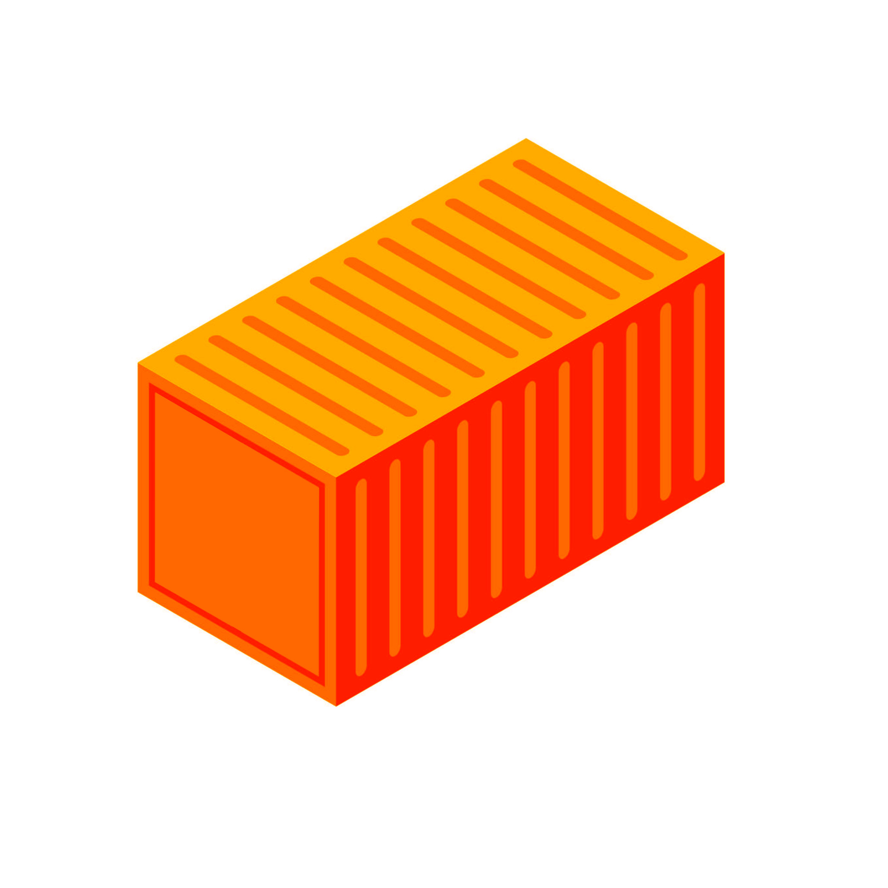

## marina

[](https://travis-ci.com/romnnn/marina)
[](https://github.com/romnnn/marina)
[](https://github.com/romnnn/marina/releases/latest)

<p align="center">
  
</p>

Your own private docker and helm registry on bare-metal kubernetes.

#### Installation via Helm chart

Add the following helm repositories that `marina` depends on:
```bash
helm repo add stable https://kubernetes-charts.storage.googleapis.com/
helm repo add harbor https://helm.goharbor.io
helm repo add ldap-manager https://romnnn.github.io/ldap-manager/charts
helm repo add marina https://romnnn.github.io/marina/charts
```

For a quickstart installation, edit and save this minimal configuration as `override.yaml`:
```yaml
ldapmanager:
  openldap:
    adminPassword: changeme1
    configPassword: changeme2
    env:
      LDAP_ORGANISATION: example
      LDAP_DOMAIN: example.com
      LDAP_BASE_DN: dc=example,dc=com
      LDAP_READONLY_USER_PASSWORD: changeme3
  ldap:
    adminPassword: changeme1
    configPassword: changeme2
    readonly:
      password: changeme3
    organization: example
    domain: example.com
    baseDN: dc=example,dc=com
  auth:
    issuer: example.com
    audience: example.com
  defaultAdminUsername: ldapadmin
  defaultAdminPassword: changeme
  ingress:
    # annotations:
    #     cert-manager.io/cluster-issuer: <your-letsencrypt-issuer>
    httpHosts:
      - host: ldap.example.com
        paths: ["/"]
    tls:
      - hosts:
          - ldap.example.com
harbor:
  expose:
    ingress:
      # annotations:
      #     cert-manager.io/cluster-issuer: <your-letsencrypt-issuer>
      hosts:
        core: core.harbor.example.com
        notary: notary.harbor.example.com
  externalURL: https://core.harbor.example.com
  harborAdminPassword: changeme
```

To install, simply run:
```bash
kubectl create namespace marina
helm install -f override.yaml --namespace marina marina marina/marina
```

You can then watch the pods by running `watch kubectl get pods -n marina`.

#### You just want to try it out?

If you just want to try things out with minikube, you can set entries in `/etc/hosts` like this:
```
<YOUR-MINIKUBE-IP>      core.harbor.example.com ldap.example.com
```
where `<YOUR-MINIKUBE-IP>` can be obtained by running `minikube ip`. 
If you have not changed any default values, you can login with `admin:changeme` or `ldapadmin:changeme` to core.harbor.example.com and `ldapadmin:changeme` to ldap.example.com.

#### You want to deploy on bare-metal kubernetes from scratch?

See [this guide](./DEPLOYMENT.md) on how to install marina in a bare-metal kubernetes cluster from start to finish.

#### Other open source solutions

TODO